# Tooli — AI-Powered Job Search OS

> A personal operating system for the modern job hunt — discovery, scoring, application tracking, networking, and analytics in one calm, fast workspace.


---

## What it does

Tooli takes the noisy job hunt and turns it into a daily, focused workflow:

- **Smart job intake** — every role flows through a deterministic classifier that scores fit by role family, level, and signal quality.
- **One-page tailored CVs** — a deterministic resume pipeline composes one-page A4 PDFs from a master JSON profile, with anti-hallucination gates and skill-tier guards.
- **Daily queue** — the next five highest-priority actions, surfaced every morning.
- **Application tracker** — Kanban pipeline with status, ghost detection, and follow-up scheduling.
- **Networking & referrals** — contacts, companies, and referral chains in one searchable graph.
- **Analytics** — interview rate, response rate, source effectiveness — the funnel you actually need to optimize.

Built mobile-first. Works seamlessly on a laptop or in Mobile Safari without compromise.

---

## Desktop

### Dashboard — morning view, focused list

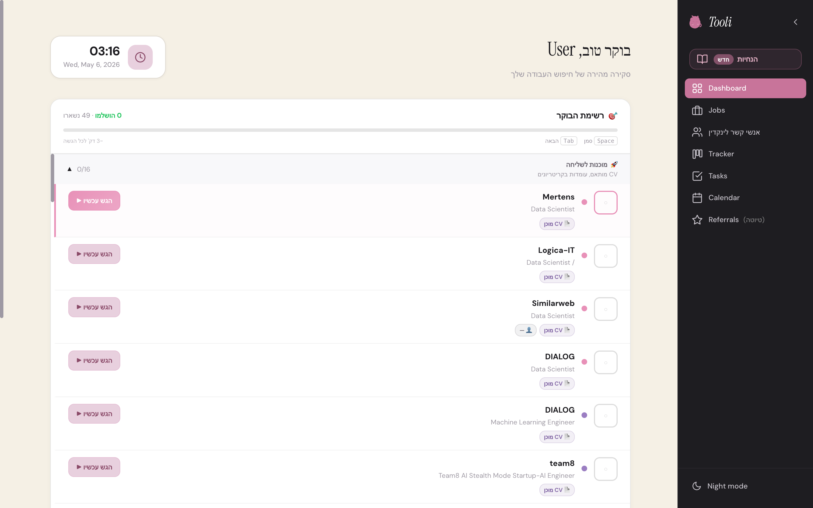

### Job inbox — filtered, scored, deduped

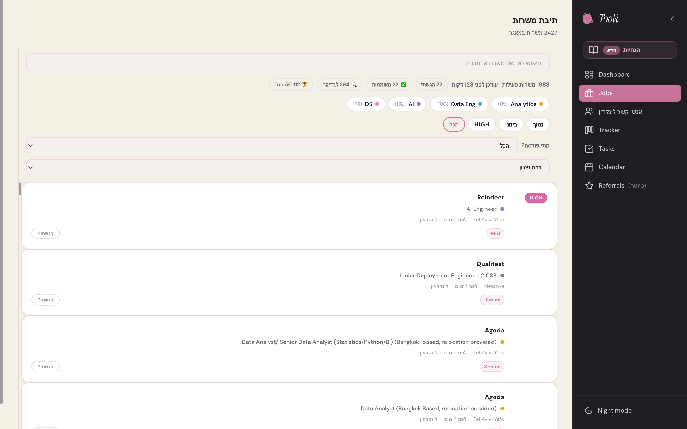

### Application tracker — Kanban pipeline

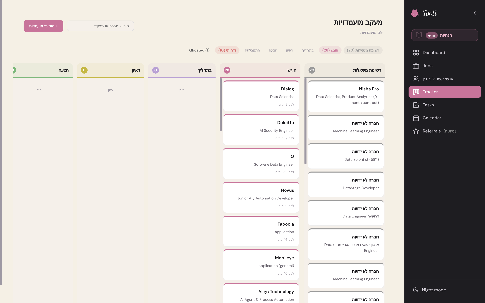

### Daily queue — what to do next

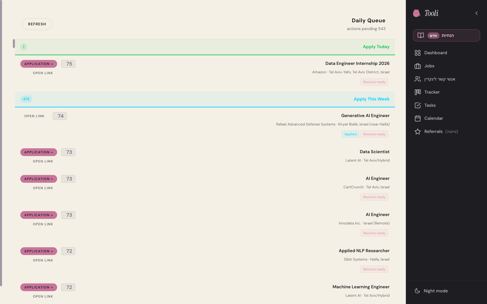

### Analytics — conversion funnel and signal

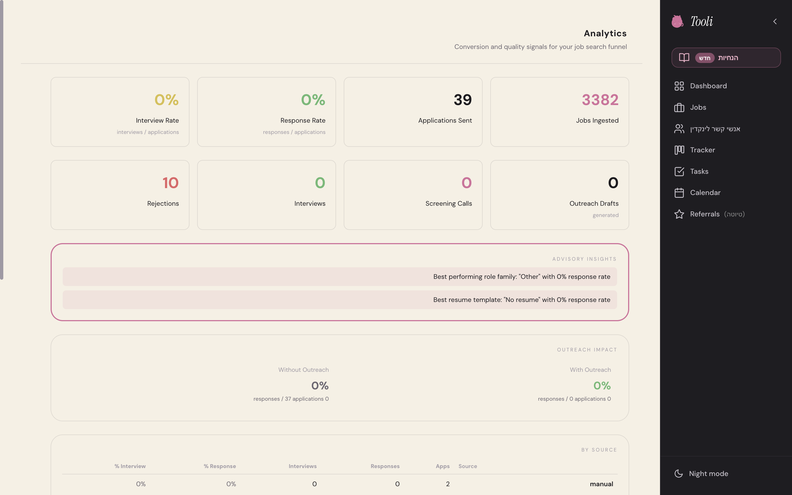

### Networking — contacts and referrals

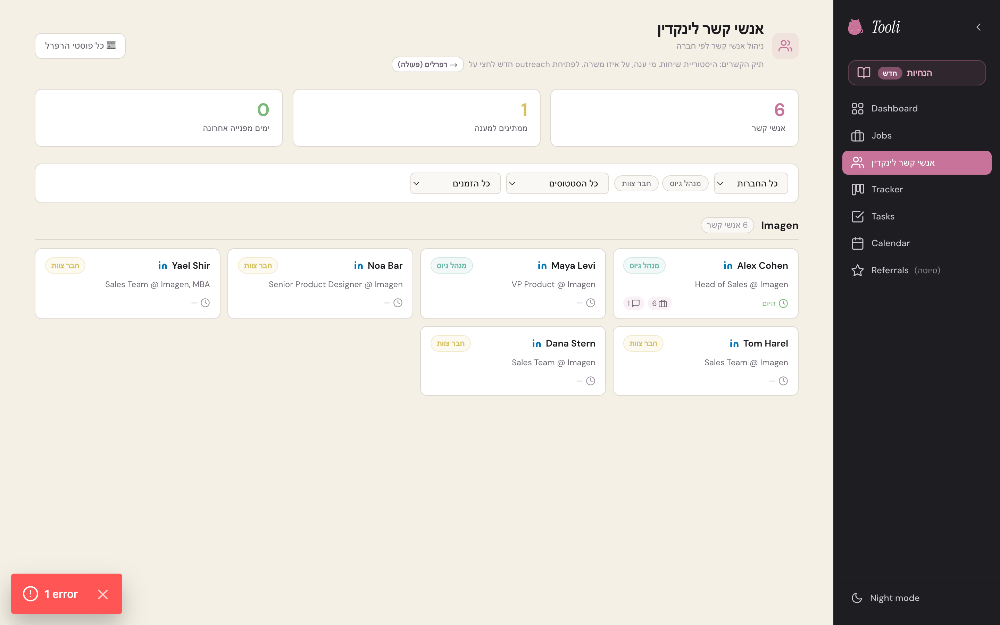

### Applications pipeline

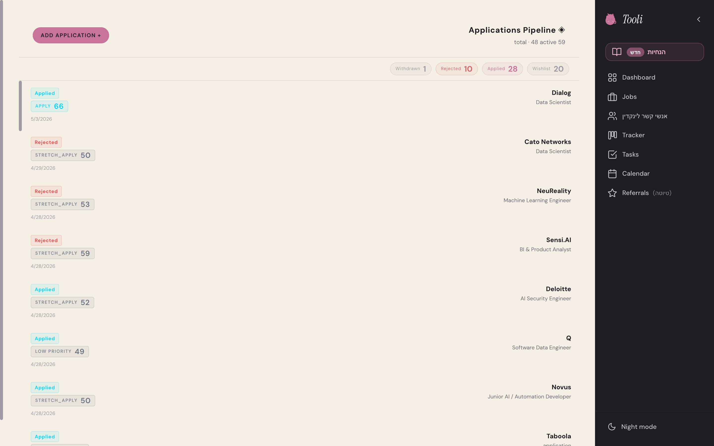

---

## Mobile

Designed mobile-first. Every flow that works on the laptop works in your pocket.

<table>
  <tr>
    <td>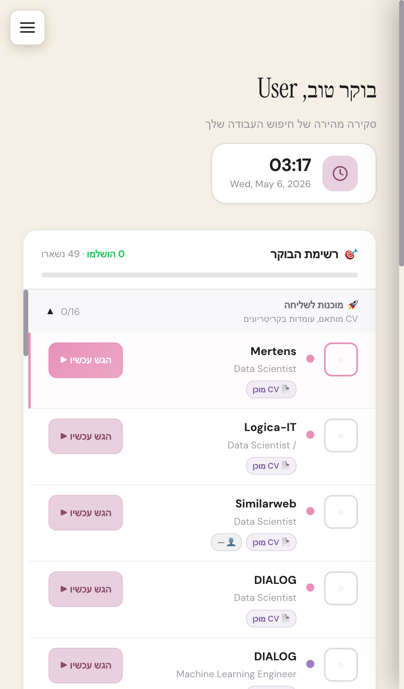</td>
    <td>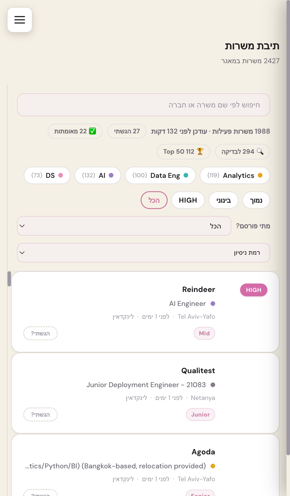</td>
    <td>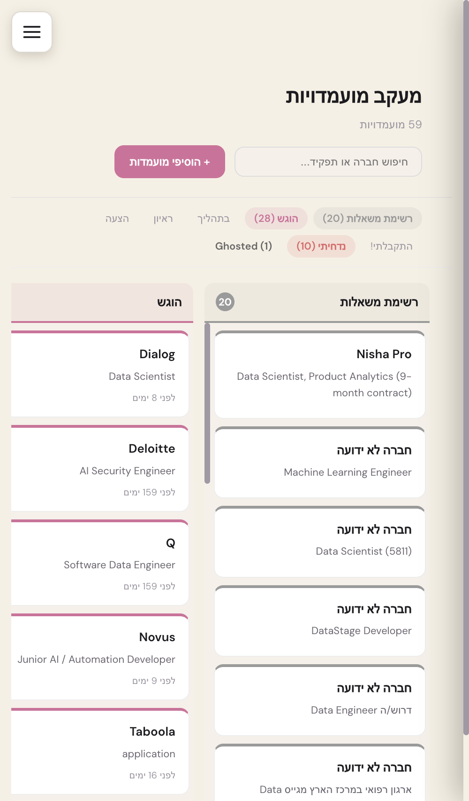</td>
  </tr>
  <tr>
    <td align="center"><sub>Dashboard</sub></td>
    <td align="center"><sub>Job inbox</sub></td>
    <td align="center"><sub>Tracker</sub></td>
  </tr>
  <tr>
    <td>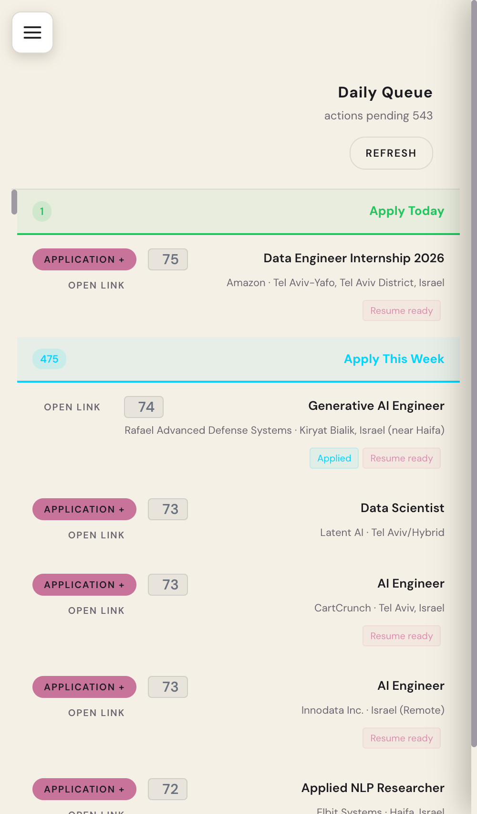</td>
    <td>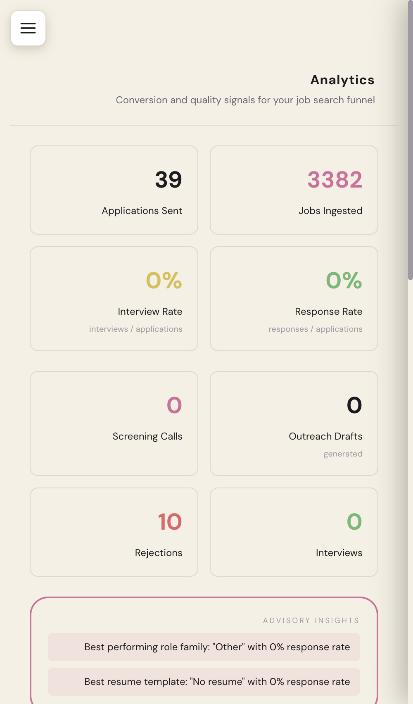</td>
    <td>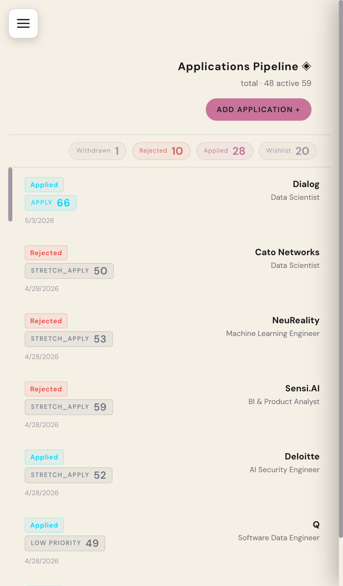</td>
  </tr>
  <tr>
    <td align="center"><sub>Daily queue</sub></td>
    <td align="center"><sub>Analytics</sub></td>
    <td align="center"><sub>Applications</sub></td>
  </tr>
</table>

---

## Architecture

```
┌─────────────────────────────────────────────────────────────┐
│                         Next.js 14                          │
│  App Router · Server Components · Server Actions · RSC      │
└──────────────┬──────────────────────────────┬───────────────┘
               │                              │
       ┌───────▼────────┐            ┌────────▼─────────┐
       │  PostgreSQL    │            │  Resume Pipeline │
       │     + Prisma   │            │  (deterministic) │
       │                │            │                  │
       │  Jobs · Apps   │            │  Master JSON →   │
       │  Contacts      │            │  Tailored TeX →  │
       │  Resumes       │            │  1-page A4 PDF   │
       └────────────────┘            └──────────────────┘
               │
       ┌───────▼────────────────────────────────────────┐
       │       Scoring & Classification Layer           │
       │  Role family · Level guard · Skill-tier gates  │
       │  Anti-hallucination · Evidence anchors         │
       └────────────────────────────────────────────────┘
```

---

## Tech stack

| Layer | Tools |
|---|---|
| **Framework** | Next.js 14 (App Router), React 18, TypeScript 5 |
| **Database** | PostgreSQL 16, Prisma ORM |
| **UI** | Tailwind CSS, Radix UI, custom design system |
| **Resume pipeline** | LaTeX, deterministic compilers, validation gates |
| **Scoring** | Heuristic classifiers, role-family taxonomy |
| **Charts** | Recharts |

---

## Design principles

1. **Calm by default.** No red badges, no notification anxiety. The morning queue is five items, not fifty.
2. **Mobile-first.** Hebrew RTL and English LTR both render correctly without bidi hacks.
3. **Deterministic over magical.** Resume generation, scoring, and ranking are all reproducible from the same inputs.
4. **One canonical source of truth.** A single master profile drives every tailored resume. No copy-paste.
5. **Speed over completeness.** A working flow today beats a perfect flow next month.

---

## Status

Active personal build, used daily. Source code is in a private repository — this repo is a visual showcase of the live system.

---

<sub>Demo screenshots are taken from the live local environment with placeholder names where personal contacts would otherwise appear. Company names visible in screenshots are public organizations and do not imply any relationship or endorsement.</sub>
